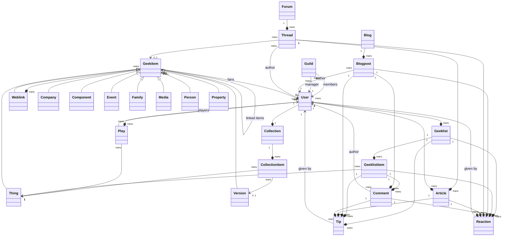

# BGG-API


[](https://sonarcloud.io/summary/new_code?id=tnaskali_bgg-api)

Spring Boot application acting as a proxy to
BoardGameGeek's [XML API](https://boardgamegeek.com/wiki/page/BGG_XML_API), [XML API 2](https://boardgamegeek.com/wiki/page/BGG_XML_API2)
and [JSON API](https://boardgamegeek.com/wiki/page/BGG_JSON_API). Its purpose is to expose the same functionalities,
mainly retrieving but also
persisting data, in a more user-friendly and developer-friendly way.

# Features

- Static BGG XML API schemas in XSD format (located under [src/main/xsd](src/main/xsd))
- Proxied XML and Json API for querying data based on their public API (no authentication required)
- Proxied Json API for mutating data (e.g. logging games) based on their public API (basic authentication required)
- (in progress) custom GraphQL API unifying these different API endpoints (schema
  under [src/main/resources/graphql](src/main/resources/graphql)) and GraphiQL UI (/bgg-api/graphiql) web interface
- OpenAPI definition and Swagger UI (/bgg-api/swagger-ui.html) web interface
- Support for building both Java and native artifacts and images

# Setup

## build and run a java application locally

Prerequisites : have Java 17+ and maven installed on your machine

Steps :

1. clone this repository on your local machine
2. run `mvn spring-boot:run`

## build and run a native application locally

Prerequisites : have GraalVM JDK 17+ and maven installed on your machine

Steps :

1. clone this repository on your local machine
2. run `mvn native:compile -Pnative` to build the native image (takes about 5 minutes)
3. run `./target/bgg-api`

## pull and run a docker java image (Linux / MacOS only)

Prerequisites : have docker installed on your machine

Steps :

1. run `docker pull ghcr.io/tnaskali/bgg-api:master` (or any other tag)
2. run `docker run --rm -p 8080:80 ghcr.io/tnaskali/bgg-api:master`

## pull and run a docker native image (Linux / MacOS only)

Prerequisites : have docker installed on your machine

Steps :

1. run `docker pull ghcr.io/tnaskali/bgg-api-native:master` (or any other tag)
2. run `docker run --rm -p 8080:80 ghcr.io/tnaskali/bgg-api-native:master`

# Usage

## Web interfaces

### Swagger UI

The Swagger UI is available at http://localhost:8080/bgg-api/swagger-ui.html once the application is running.

### GraphiQL UI

The GraphiQL UI is available at http://localhost:8080/bgg-api/graphiql once the application is running.

## Authentication

### XML endpoints

(not yet implemented) Since late 2025, all XML API endpoints require authentication. Only Bearer token authentication is
supported. See https://boardgamegeek.com/using_the_xml_api for details on how to create an application and generate a
bearer token.

### JSON endpoints

Some JSON API endpoints require authentication. Only basic authentication using your BGG username and password is
supported. Under the hood, these will be exchanged for a session cookie used to authenticate requests to BGG.

### A word about security

Bearer tokens and basic credentials will be transmitted in clear using unsecured HTTP protocol from your browser to the
locally running Spring Boot application and will only be kept in memory for the duration of the session. The API itself
will use a secure HTTPS connection to perform authentication to boardgamegeek.com.

## Sample request body for logging a play

endpoint: /bgg-api/api/v3/geekplay (POST, basic auth)

```json
{
  "ajax": 1,
  "action": "save",
  "objectid": 1000,
  "objecttype": "thing",
  "playdate": "2023-08-03",
  "comments": "comments go here",
  "length": 60,
  "location": "Home",
  "quantity": 3,
  "players": [
    {
      "name": "Non-BGG Friend",
      "position": "1",
      "color": "blue",
      "score": "18",
      "rating": 7,
      "win": true,
      "new": false
    },
    {
      "username": "tnaskali",
      "new": true
    }
  ]
}
```

## Sample graphQL user query

endpoint: /bgg-api/graphql (POST, no auth)

```graphql
{
    userByUsername(username: "tnaskali") {
        id,
        firstname,
        lastname,
        username,
        dateregistered,
        supportyears,
        designerid,
        publisherid,
        address {
            city,
            isocountry
        },
        guilds{
            id,
            name,
            manager{
                id,
                username
            },
            members {
                user {
                    id,
                    username
                },
                joined
            }},
        microbadges {
            id,
            name,
            imagesrc
        },
        top{
            boardgame{
                rank,
                id,
                type,
                name
            }
        }
    }
}
```

# Terms of use

This is just a proxy to BoardGameGeek's API, so
[their terms of use](https://boardgamegeek.com/wiki/page/XML_API_Terms_of_Use#) still apply. Be sure to read them
before deciding to use this API.

# Credits and inspirations

- BGG's XML API 2 : https://boardgamegeek.com/wiki/page/BGG_XML_API2
- BGG's database structure : https://boardgamegeek.com/wiki/page/Database_Structure
- Fisico's thread on BGG forum : https://boardgamegeek.com/thread/1010057/xml-schema-for-bgg-xml-api2
- Reddit Thread on how to log plays
  programmatically : https://www.reddit.com/r/boardgames/comments/ez86me/uploading_games_plays_to_bgg_programmatically/
- Baeldung's tutorial on Spring Security Custom Authentication
  Provider : https://www.baeldung.com/spring-security-authentication-provider

# Extras

## BGG Data model

