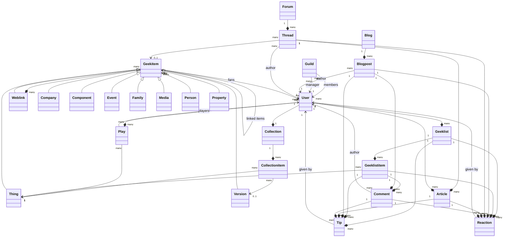

# BGG-API


[](https://sonarcloud.io/summary/new_code?id=tnaskali_bgg-api)

[/pic7779581.png)](https://boardgamegeek.com/using_the_xml_api#toc13)

Spring Boot application acting as a proxy to BoardGameGeek's
[XML API](https://boardgamegeek.com/wiki/page/BGG_XML_API), [XML API 2](https://boardgamegeek.com/wiki/page/BGG_XML_API2)
and [JSON API](https://boardgamegeek.com/wiki/page/BGG_JSON_API), exposing the same data in a more user- and
developer-friendly way.

## Features

- Static BGG XML API schemas in XSD format (under [src/main/xsd](src/main/xsd))
- Proxied XML/JSON API for querying data (no authentication required)
- Proxied JSON API for mutating data, e.g. logging plays (basic authentication required)
- (in progress) Custom GraphQL API unifying these endpoints (schema under
  [src/main/resources/graphql](src/main/resources/graphql)), with a GraphiQL UI
- OpenAPI definition with a Swagger UI
- Java and GraalVM native builds/images

## Prerequisites

- A BGG application token, required for the XML API v1, v2 and GraphQL endpoints: request one from
  [this page](https://boardgamegeek.com/using_the_xml_api)
- One of
  - run `mise install` after [installing Mise](https://mise.jdx.dev/getting-started.html) to bootstrap the pinned
    Java, Maven and GraalVM versions from [mise.toml](mise.toml) in one step
  - install Maven, a JDK 17+ or a GraalVM JDK 17+ (only for native builds)
- Docker if planning to build and run the app in a container

## Getting started

Set your token once:

```shell
export BGG_APPLICATION_TOKEN=your-token-here
```

Then start the application with any of the following.

Out of the box, using published images — only Docker required:

| tool | JVM | Native image |
| --- | --- | --- |
| Docker | `docker run --rm -p 8080:8080 -e BGG_APPLICATION_TOKEN=${BGG_APPLICATION_TOKEN} ghcr.io/tnaskali/bgg-api` | `docker run --rm -p 8080:8080 -e BGG_APPLICATION_TOKEN=${BGG_APPLICATION_TOKEN} ghcr.io/tnaskali/bgg-api-native` |
| Docker Compose | `docker compose -f https://github.com/tnaskali/bgg-api.git up` | `docker compose -f https://github.com/tnaskali/bgg-api.git#master:docker-compose.native.yml up` |

From a local clone, building from source — Mise or the whole build toolchain required:

| tool | JVM | Native image |
| --- | --- | --- |
| Mise | `mise run run` | `mise run native:run` |
| Mise (Docker) | `mise run docker:run` | `mise run docker:run:native` |
| Maven | `mvn spring-boot:run` | `mvn native:compile -Pnative && ./target/bgg-api` |
| Maven + Docker | `mvn package && docker compose up --build` | `mvn native:compile -Pnative && docker compose -f docker-compose.native.yml up --build` |

Once running, the API is available at http://localhost:8080/bgg-api.

## Usage

### Web interfaces

- Swagger UI: http://localhost:8080/bgg-api/swagger-ui.html
- GraphiQL UI: http://localhost:8080/bgg-api/graphiql

### Authentication

Some JSON API endpoints require basic authentication using your BGG username and password, which is exchanged
under the hood for a session cookie used to authenticate requests to BGG. Credentials are sent over plain HTTP
between your client and the locally running application, and kept in memory only for the duration of the session;
BGG itself is always accessed over HTTPS.

### Sample request: log a play

`POST /bgg-api/api/v3/geekplay` (basic auth)

```json
{
  "ajax": 1,
  "action": "save",
  "objectid": 1000,
  "objecttype": "thing",
  "playdate": "2023-08-03",
  "comments": "comments go here",
  "length": 60,
  "location": "Home",
  "quantity": 3,
  "players": [
    {
      "name": "Non-BGG Friend",
      "position": "1",
      "color": "blue",
      "score": "18",
      "rating": 7,
      "win": true,
      "new": false
    },
    {
      "username": "tnaskali",
      "new": true
    }
  ]
}
```

### Sample request: GraphQL user query

`POST /bgg-api/graphql` (no auth)

```graphql
{
    userByUsername(username: "tnaskali") {
        id,
        firstname,
        lastname,
        username,
        dateregistered,
        supportyears,
        designerid,
        publisherid,
        address {
            city,
            isocountry
        },
        guilds{
            id,
            name,
            manager{
                id,
                username
            },
            members {
                user {
                    id,
                    username
                },
                joined
            }},
        microbadges {
            id,
            name,
            imagesrc
        },
        top{
            boardgame{
                rank,
                id,
                type,
                name
            }
        }
    }
}
```

## Development

Build and test commands can be run either directly with Maven or, if you have [Mise](https://mise.jdx.dev)
installed, via the task shortcuts it defines in [mise.toml](mise.toml) (Mise also pins the exact Java, Maven and
GraalVM versions used by this project — entirely optional).

| task | mvn | Mise |
| --- | --- | --- |
| clean `target/` | `mvn clean` | `mise run clean` |
| check formatting/linting | `mvn spotless:check` | `mise run check` |
| apply formatting | `mvn spotless:apply` | `mise run fix` |
| package (+ unit tests) | `mvn package` | `mise run build` |
| full test suite (unit + IT) | `mvn verify` | `mise run test` |
| build native image | `mvn native:compile -Pnative` | `mise run native:build` |
| test suite against native image | `mvn test -PnativeTest` | `mise run native:test` |
| build Docker image (JVM) | `docker compose -f docker-compose.yml build` | `mise run docker:build` |
| build Docker image (native) | `docker compose -f docker-compose.native.yml build` | `mise run docker:build:native` |

## Terms of use

This is just a proxy to BoardGameGeek's API, so [their terms of use](https://boardgamegeek.com/wiki/page/XML_API_Terms_of_Use#)
still apply.

## Data model


```mermaid
classDiagram

%% Relationships
    Guild "many" --> "many" User: members
    Guild "many" --> "1" User: manager
    User "1" --* "1" Collection
    Collection "1" --* "many" Collectionitem
    Collectionitem "many" --> "1" Thing
    Collectionitem "many" --> "0..1" Version
    User "many" --* "many" Play
    Play "many" --> "1" Thing
    Play "many" --> "many" User: players
    User "1" --* "many" Geeklist
    Geeklist "1" --* "many" Geeklistitem
    Geeklist "1" --* "many" Tip
    Geeklist "1" --* "many" Reaction
    Geeklistitem "many" --> "1" Thing
    Geeklistitem "1" --* "many" Comment
    Geeklistitem "1" --* "many" Tip
    Geeklistitem "1" --* "many" Reaction
    Blog "1" --* "many" Blogpost
    Blogpost "many" --> "1" User: author
    Blogpost "1" --* "many" Comment
    Blogpost "1" --* "many" Tip
    Blogpost "1" --* "many" Reaction
    Forum "1" --* "many" Thread
    Thread "many" --> "1" User: author
    Thread "many" --> "0..1" Geekitem
    Thread "1" --* "many" Article
    Thread "1" --* "many" Reaction
    User "1" --* "many" Article
    Article "1" --* "many" Tip
    Article "1" --* "many" Reaction
    Geekitem "many" --> "many" Geekitem: linked items
    Geekitem "many" --* "many" Weblink
    Geekitem "many" --> "many" User: fans
    Comment "many" --> "1" User: author
    Comment "1" --* "many" Tip
    Comment "1" --* "many" Reaction
    Reaction "many" --> "1" User: given by
    Tip "many" --> "1" User: given by
%% Inheritance from Object
    Geekitem <|-- Company
    Geekitem <|-- Component
    Geekitem <|-- Event
    Geekitem <|-- Family
    Geekitem <|-- Media
    Geekitem <|-- Person
    Geekitem <|-- Property
    Geekitem <|-- Thing
    Geekitem <|-- Version
    Geekitem <|-- Weblink

```

## Credits

- BGG's XML API 2: https://boardgamegeek.com/wiki/page/BGG_XML_API2
- BGG's database structure: https://boardgamegeek.com/wiki/page/Database_Structure
- Fisico's thread on BGG forum: https://boardgamegeek.com/thread/1010057/xml-schema-for-bgg-xml-api2
- Reddit thread on how to log plays programmatically: https://www.reddit.com/r/boardgames/comments/ez86me/uploading_games_plays_to_bgg_programmatically/
- Baeldung's tutorial on Spring Security custom authentication provider: https://www.baeldung.com/spring-security-authentication-provider

## License

[Unlicense](LICENSE) — public domain.
